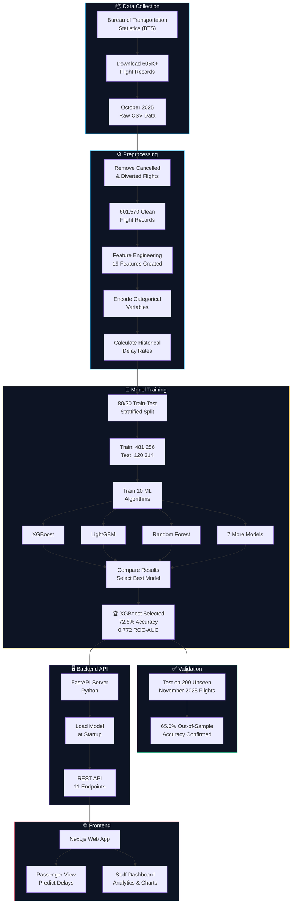
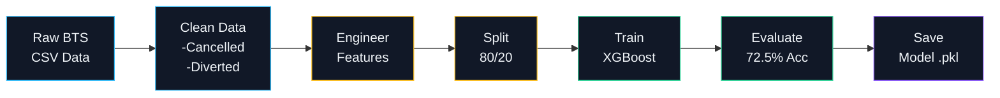
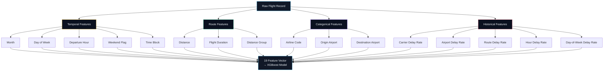
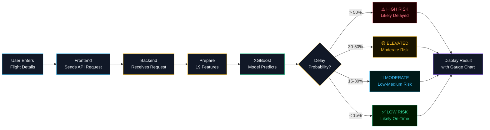
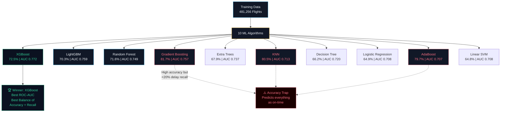
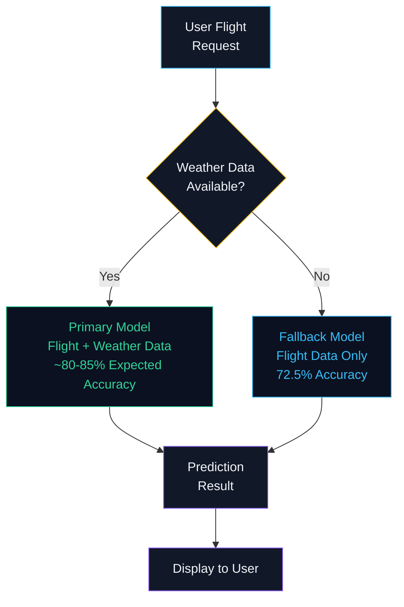
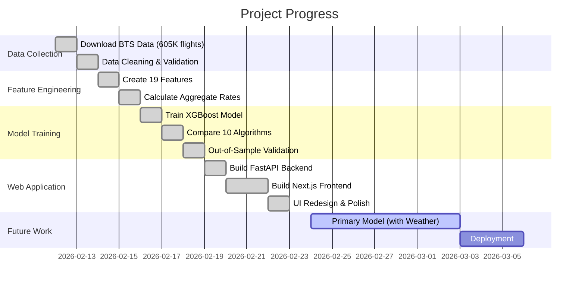

# Project Flowchart — Flight Delay Prediction System

## System Architecture Flowchart

---

## ML Pipeline Flowchart

---

## Feature Engineering Flowchart

---

## Prediction Flow (User Request)

---

## Model Comparison Flowchart

---

## Dual-Model Architecture (Future Scope)

---

## Project Progress Timeline

