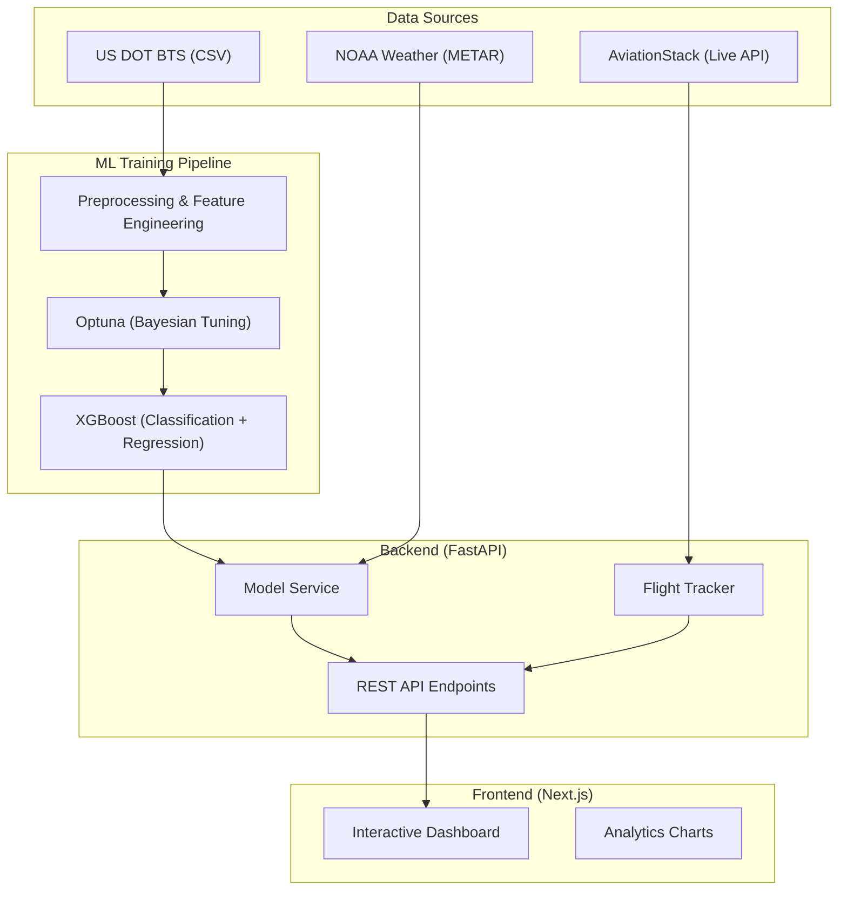

# Full System Architecture

SkyPredict is a distributed machine learning platform designed for real-time flight delay analysis and prediction.

## 1. High-Level Architecture

The system follows a three-tier architecture:

1.  **Modeling Tier**: Offline training pipeline (XGBoost + Optuna) processing historical US DOT datasets (600k-10M records).
2.  **Backend Tier**: A persistent FastAPI service providing a RESTful API for predictions, analytics, and health monitoring.
3.  **Frontend Tier**: An interactive Next.js dashboard for real-time visualization and user queries.

## 2. Component Diagram (Conceptual)

## 3. Data Integration Flow

1.  **Historical**: The system processes 12 months of flight data to build robust feature vectors (mean delay rates, congestion proxies).
2.  **External**: METAR weather data for 346 airports is merged at prediction time to account for environmental factors.
3.  **Real-Time**: The `FlightTracker` service uses the AviationStack API to fetch live status, allowing users to compare ML predictions with actual current aircraft telemetry.
